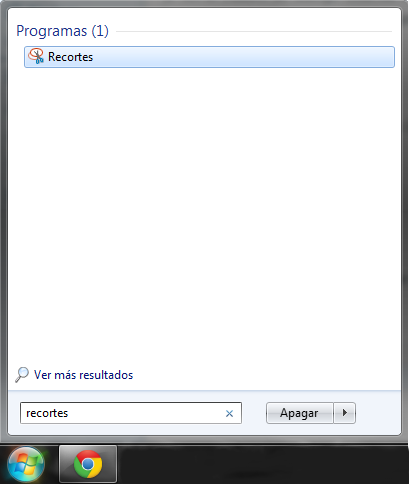

### ¿Cómo hago una captura de pantalla?

Mantén pulsada <WinKey/>  y	<ShiftKey/>	 y  pulsa	<SKey/>	=	Utilice el ratón para dibujar un **rectángulo** especificando qué quieres capturar. Windows captura esta zona y la copia en el **portapapeles**.

### Suponemos que la captura está ahora en el portapapeles. ¿Cómo puedo pegarla en un documento o algo?

Mantén pulsada <CtrlKey/> y pulsa <VKey/> =  Windows pega la captura de pantalla (que está en el **portapapeles**) en un documento o en una imagen que estés editando.

### ¿Dónde debo pegarla? Sólo necesito un archivo gráfico.

1. Inicia “Paint”
2. Pega
3. Guarda

### ¿Cómo hago una captura de pantalla y la guardo directamente como archivo?

Mantén pulsada	<WinKey/>	y pulsa	<PrtScnKey/>	=	Windows (8 o 10) captura la totalidad de la **pantalla** y la guarda como archivo en tu carpeta **Imágenes** > **Capturas de pantalla**.

### ¿Hay un programa dedicado a hacer capturas de pantalla? ¿Cómo puedo encontrarlo?

{/* Import CSS modules */}
import styles from '../components/keys.module.css'

export const Stars = () => {
  return <strong>okkk </strong>
}

export const WinKey = () => {
   return 
}

export const ShiftKey = () => {
   return Shift
}

export const SKey = () => {
   return S
}
export const VKey = () => {
   return V
}
export const PrtScnKey = () => {
   return PrtScn
}

export const CtrlKey = () => {
   return Ctrl
}
